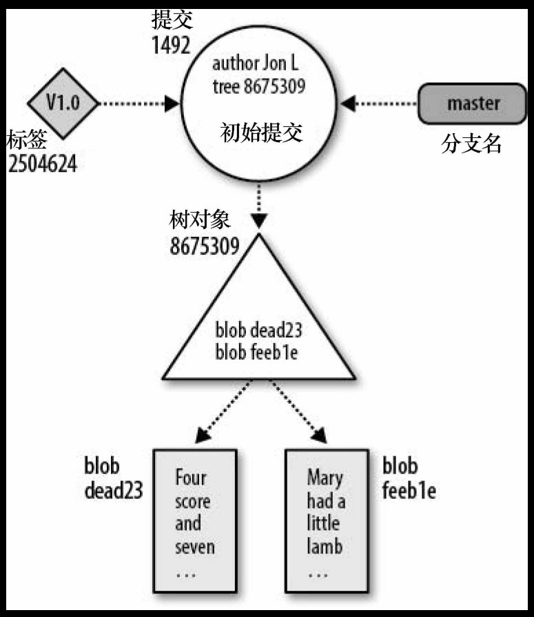
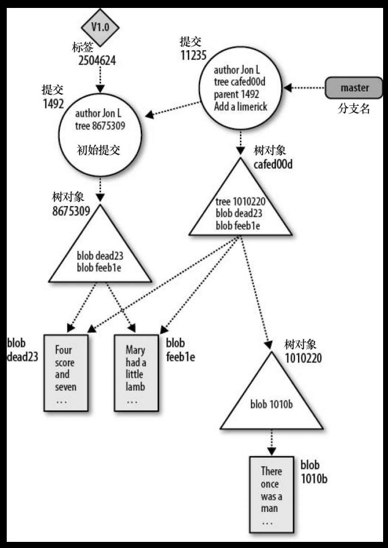

## Git概述

### git特点或设计理由
- 有助于分布式开发
- 能够胜任上千开发人员的规模
- 性能优异（压缩技术、差异比较技术）
- 保持完整性和可靠性（安全散列函数）
- 强化责任（对所有改动可追踪）
- 不可变性
- 原子事务（Git通过记录完整、离散的版本库状态来实现原子事务。）
- 支持并且鼓励基于分支的开发（分支、合并）
- 完整的版本库（每个人的版本库中都有一份关于每个文件的完整的历史修订信息）
- 一个清晰的内部设计（对象模型）
- 免费自由

### 基本概念

git版本库：一个简单的数据库，数据库，其中包含所有用来维护与管理项目的修订版 本和历史的信息。

两个主要数据结构：  
- 对象库：Git版本库实现的心脏。包含你的原始数据文件、所有日志信息、日期等等。它包括4中对象类型：
  - 块（blob）：二进制大对象。文件的每一个版本表示为一个块。一个blob只保存一个文件的数据。
  - 目录树（tree）：一个tree对象代表一层目录信息。它记录blob标识符、路径名和一个目录里所有文件的一些元数据。可递归引用其他目录树或子树对象。
  - 提交（commit）：一个commit对象保存版本中每一次变化的元数据，包括作者、提交者、提交日期和日志消息。
  - 标签（tag）：一个tag对象分配一个任意的且人类可读的名字给一个特定对象。
- 索引：一个临时的、动态的二进制文件，它描述整个版本库的目录结构。

分支：

对象之间的关系：  
- blob对象是数据结构的“底端”。只能被树对象引用。
- 树对象指向若干blob对象，也可能指向其他树对象。
- 每一个提交对象指向一个目录树对象。
- 每个标签可以指向最多一个提交对象。

图说：  
状态1：一个版本库在添加了两个文件的初始提交后的状态。

状态2：添加一个包含一个文件的新子目录。

SHA1散列值：160位的数，表示为40位的16进制。（Git中，SHA1 == 散列码 == 对象ID）

Git追踪的是内容而不是文件。  
文件变更时，Git内部数据库有效地存储每个文件的每个版本，而不是它们的差异。  

打包文件：Git使用的一种高效的存储机制。即存储一个文件的整个版本并存储用来构造其他版本的相似文件的差异。Git有更复杂的打包算法。

配置文件（.ini文件风格的文本文件）

Git中的文件分类：  
- 已追踪的（Tracked）：指已经在版本库中的文件，或是已暂存到索引中的文件。
- 被忽略的（Ignored）：在版本库中被明确声明为不可见或被忽略的文件。
- 未追踪的（Untracked）：不在版本库中的文件，但在工作目录中文件。

.gitignore文件  

提交（commit）操作：  

### 功能概览

查看提交差异。

文件重命名后，使用 "git log --follow filename" 查看包括旧文件名的历史记录。

查看提交历史记录：  
git log ：
- "-n" : 限制n个提交历史记录
- "--stat" : 显示每次提交的更改的文件和对应行数  

git show : 可以查看某个特定提交

### 状态机
- NULL
- init(I)
- untracked(UT)
- unstaged(US)
- staged(S) 
- commited(C)

git rm --cached : S -> UT  
git rm : I -> S ,  
Git在删除一个文件前，会先进行检查以确保工作目录下该文件的版本与当前分支中最新版本是匹配的。这个验证会防止文件的修改意外丢失。使用 -f 强制删除。

git checkout -- \<file\> : US -> I  

"git reset HEAD \<file\>..." : S -> US  

"git mv oldfilename newfilename" : I -> S  

